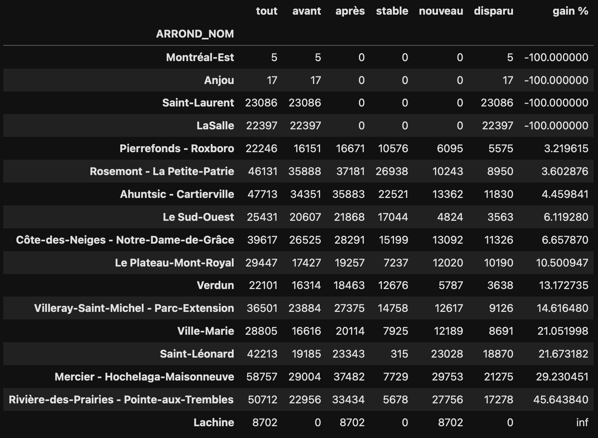

# Arbres Montréal

## Source des données :

Les données proviennent de [https://donnees.montreal.ca/dataset/arbres](https://donnees.montreal.ca/dataset/arbres). Le nom des données utilisées est **Inventaire arbres publics - Fichier consolidé (Arrondissements dans le système corporatif seulement)**.

Dans le dossier `input` du présent repo se trouve les données téléchargées à deux dates données :

- `2021-12-11_arbres-publics.csv` venant de [https://www.donneesquebec.ca/recherche/dataset/vmtl-arbres/resource/64e28fe6-ef37-437a-972d-d1d3f1f7d891](https://www.donneesquebec.ca/recherche/dataset/vmtl-arbres/resource/64e28fe6-ef37-437a-972d-d1d3f1f7d891) consulté le 2021-12-11.
- `2025-10-29_arbres-publics.csv` venant de [https://donnees.montreal.ca/dataset/arbres](https://donnees.montreal.ca/dataset/arbres) consulté le 2025-10-29.

L'intérêt d'utiliser la même source de données à deux dates différentes est d'éviter le [biais du survivant](https://fr.wikipedia.org/wiki/Biais_des_survivants) puisque les arbres présents dans le fichier de données existent encore à cette date, mais non ceux qui n'existent plus. Puisque les anciennes données ne sont pls 

## Création d'un identifiant par arbre

Les arbres n'ont pas d'identifiant unique. On peut en déduire un en combinant les variables `EMP_NO` (un entier qui dénote l'emplacement physique), `Sigle` (sigle qui représente l'essence d'arbre), `Date_Releve` (la date du relevé), `Date_Plantation` (la date de plantation). À l'intérieur d'un fichier de donnée on remarque que l'identifiant par arbre ainsi créé est effectivement sans doublon.

La création d'un identifiant unique par arbre permet de faire une jointure entre les anciennes et les nouvelles données.

## Résultat

À la fin du notebook `arbres_mtl.ipynb` on constate que les arbres des quartiers suivants ne sont plus comptabilisés (gain d'arbres de -100%) :

- `Montréal-Est`
- `Anjou`
- `Saint-Laurent`
- `LaSalle`

Inversement, le quartier suivant est nouvellement comptabilisé (gain d'arbres de +infini %) :

- `Lachine`

Pour les autres quartiers le changement du nombre d'arbres semble réaliste :

